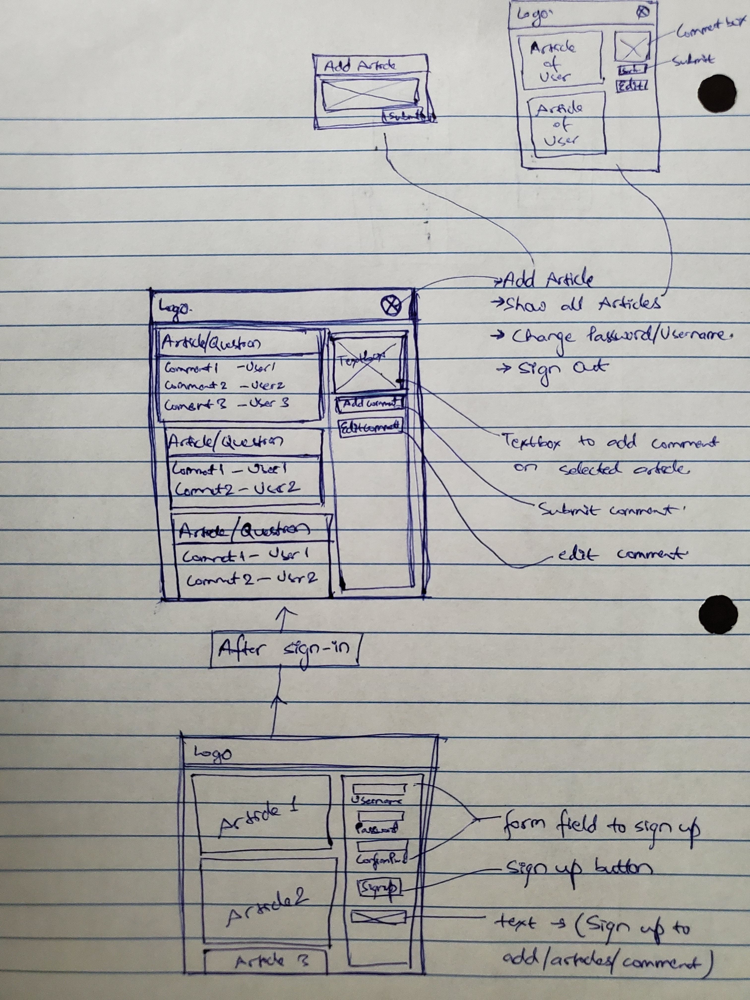

# Coffee Talks

This is an application built to create a platform where a user can read and interact with articles of other users as well as create/modify/delete their own aticles. The application is basically a single page but with multiple views. The backend server for the application is deployed and hosted on heroku while the main application itself is hosted on github.

## Links
**Deployed Application :** <https://maharit108.github.io/Coffee-Talk/>

**API documentation :** <https://github.com/maharit108/Coffee-Talk-API>

## Technologies Used
- HTML/CSS
- JQuery
- AJAX
- JS

## Planning Story
The complete project was to build both Front and Back end for this application in the course of a week. The project was first divided into Front and Back end. Back end was completed in around first 2 days with some minor adjustments around the end of the week. The remaining days were dedicated to build the frond end application.

Front end of Coffee Talks can be further broken down in 3 parts depending on resource - articles, comments and user. For each of the resources, CRUD operations are performed using AJAX request calls to the server. A user can sign up, sign in, change password and sign out.A user can see all articles from all users without having to sign in.  A user can create, edit, view own articles and delete them once user authentication is completed (sign in). Similarly, a user can create, edit and delete comments on each articles after signing in. User can like a dislike an article after signing in.

By toggling views in the application, various interface is presented to user depending on the action by the user. On start, user is presented with a view displaying all articles and option to sign in and sign up. Once signed in, The sign up and sign in view is hidden and other features like adding, editing and deleting articles/comments, change password, sign out etc. is presented.

In the application, HTML is used for basic structure of application with CSS for styling. AJAX calls are used extensively to interact with server making use of promises to handle responses from server. JQuery/JS is used for basic logical processes in the application. Overall, this application is an attempt to mimic the basic features of popular social media platforms using just JQuery and AJAX in the client side.

## User Stories
- As a user, I would like to see all the articles posted by various users.
- As a user, I would like to add my comments and thoughts on the articles.
- As a user, I would like to edit or delete my comments.
- As a user, I would like to add my own articles/questions.
- As a user, I would like to close discussions on my articles, make edits and delete.
- As a user, I would like to create an account where i can see all my articles and comments.
- As a user, I would like that only I can make edits and delete my articles/comments.

___
## Future Upgrades
- Add like/dislike button to comments.
- Only 3 comments visible for an articles at start. All comments show up only when user clicks on 'show previous comments'
- Sort articles by date, popularity
- Add tags to articles so that articles can be sorted based on the tags (sports, politics, science, programming etc.)
- Add more styling and cleaner look.
- Better look/styling in smaller screen devices (media query)
___
## Wireframe

